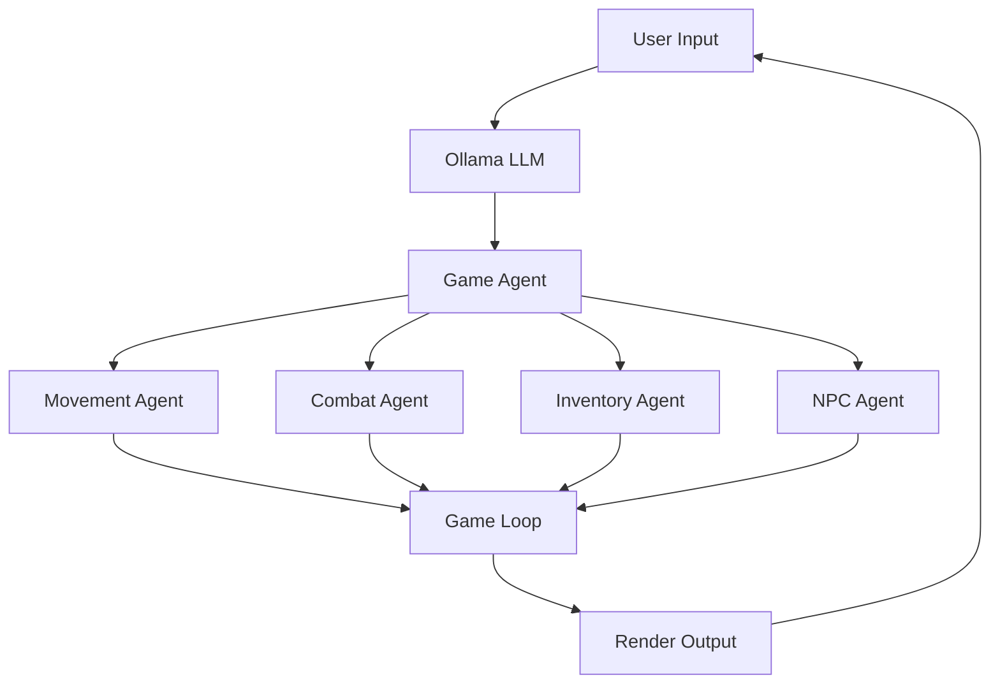

# AI-Powered RPG Game Architecture

## System Overview

Our game engine is built on a modular, agent-based architecture where each component is an independent AI-driven module. The system uses Ollama for natural language processing and Pygame for rendering.

## Core Components

### 1. Input Layer
- **User Input Handler**
  - Captures natural language commands
  - Processes keyboard/mouse events
  - Routes input to LLM processor

### 2. AI Processing Layer
- **Ollama LLM Processor**
  - Interprets natural language commands
  - Converts user intent into game actions
  - Provides context-aware responses

### 3. Game Agent Layer
- **Main Game Agent (Orchestrator)**
  - Routes commands to appropriate sub-agents
  - Manages game state
  - Coordinates agent interactions

### 4. Specialized Agents
- **Movement Agent**
  ```python
  # Handles player movement and collision
  class MovementAgent:
      def handle_movement(self, command):
          # Process movement commands
          pass
  ```
- **Combat Agent**
  ```python
  # Manages combat mechanics
  class CombatAgent:
      def handle_combat(self, command):
          # Process combat actions
          pass
  ```
- **Inventory Agent**
  ```python
  # Controls item management
  class InventoryAgent:
      def handle_inventory(self, command):
          # Process inventory actions
          pass
  ```
- **NPC Agent**
  ```python
  # Manages NPC interactions
  class NPCAgent:
      def handle_dialogue(self, command):
          # Generate AI responses
          pass
  ```

### 5. Game Loop Layer
- **Main Game Loop**
  - Updates game state
  - Renders graphics
  - Processes agent outputs

## Data Flow



## Agent Communication

Agents communicate through a message-passing system:

1. **Command Flow**
   ```python
   user_input -> LLM -> GameAgent -> SpecificAgent -> GameLoop
   ```

2. **Response Flow**
   ```python
   SpecificAgent -> GameAgent -> GameLoop -> Render
   ```

## State Management

Each agent maintains its own state:

```python
class GameState:
    def __init__(self):
        self.player_pos = (0, 0)
        self.inventory = {}
        self.health = 100
        self.current_map = None
```

## Extensibility

The system is designed for easy expansion:

1. **Adding New Agents**
   ```python
   class NewAgent:
       def __init__(self):
           self.state = {}
       
       def handle_command(self, command):
           # Process specific commands
           pass
   ```

2. **Extending Existing Agents**
   ```python
   class EnhancedCombatAgent(CombatAgent):
       def handle_special_moves(self, command):
           # Add new combat mechanics
           pass
   ```

## Performance Considerations

- GPU Acceleration for rendering
- Async command processing
- Efficient state updates
- Optimized agent communication

## Future Expansions

1. **AI Dungeon Master**
   - Dynamic story generation
   - Adaptive difficulty
   - Personalized quests

2. **Multiplayer Support**
   - Synchronized state
   - Multi-agent interactions
   - Collaborative storytelling

3. **Advanced AI Features**
   - Procedural content generation
   - Dynamic NPC personalities
   - Adaptive game mechanics

## Development Guidelines

1. **Adding New Features**
   - Create new agent class
   - Register with GameAgent
   - Implement state management
   - Add rendering support

2. **Modifying Existing Agents**
   - Extend base agent class
   - Override necessary methods
   - Update state handling
   - Test interactions

## Testing Architecture

```python
class AgentTest:
    def setup(self):
        self.game_agent = GameAgent()
        self.test_state = GameState()

    def test_command_flow(self):
        # Test command processing
        pass

    def test_state_updates(self):
        # Test state management
        pass
``` 