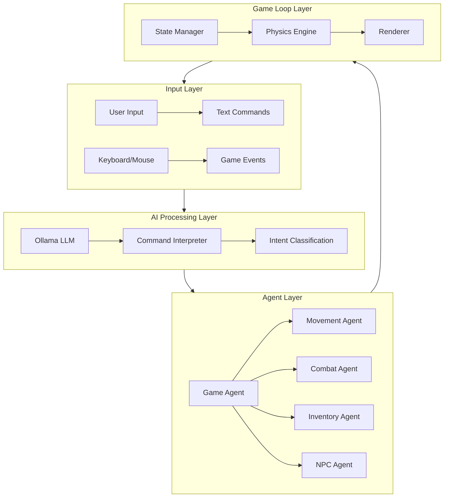
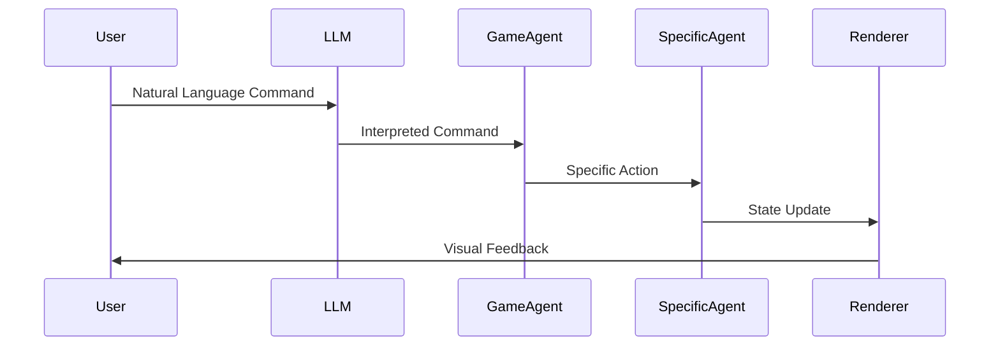
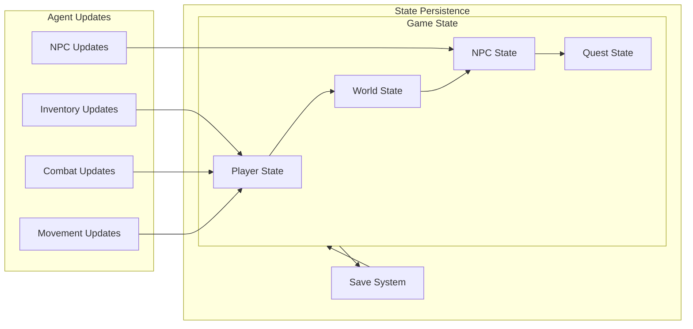
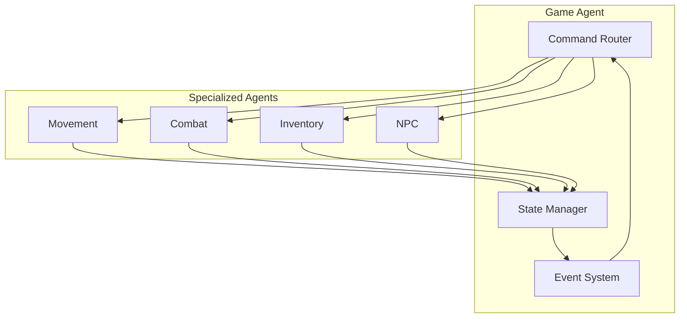
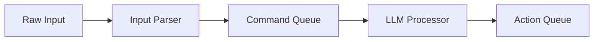
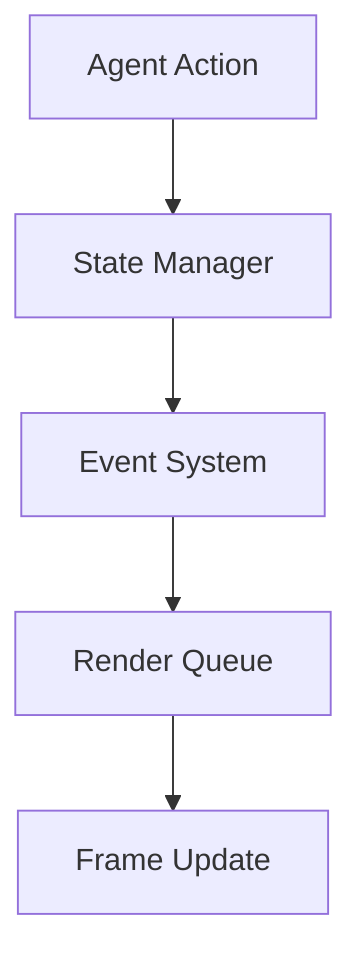
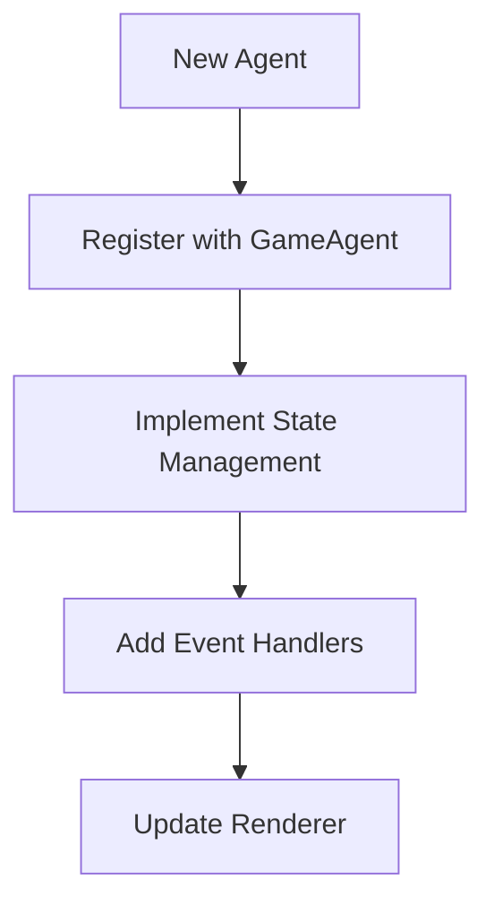
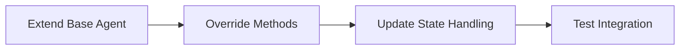

# AI-Powered RPG System Diagrams

## 1. High-Level System Architecture



## 2. Command Flow Diagram



## 3. State Management Flow



## 4. Agent Communication Network



## 5. Data Flow Explanation

### Command Processing Pipeline
1. **User Input** → Natural language command entered
2. **LLM Processing** → Command interpreted by Ollama
3. **Intent Classification** → Action type determined
4. **Agent Selection** → Appropriate agent chosen
5. **Action Execution** → Command processed by agent
6. **State Update** → Game state modified
7. **Render Update** → Visual feedback provided

### State Update Cycle
1. **Agent Action** → State modification requested
2. **Validation** → Change verified against rules
3. **State Update** → Modification applied
4. **Event Emission** → Change broadcasted
5. **Render Queue** → Visual update scheduled
6. **Frame Update** → Change displayed

### Inter-Agent Communication
- **Message Types**
  - Commands (action requests)
  - Events (state changes)
  - Queries (state requests)
  - Responses (data returns)

- **Communication Flow**
  ```
  Agent A → Game Agent → Agent B
  ```

## 6. Component Interactions

### Input Processing


### State Updates


## 7. System Extensibility

### Adding New Features


### Modifying Existing Features


## Notes

1. **Performance Optimization Points**
   - LLM processing queue
   - State update batching
   - Render optimization
   - Event system efficiency

2. **Scalability Considerations**
   - Agent independence
   - State isolation
   - Event broadcasting
   - Resource management

3. **Future Expansion Areas**
   - Multiplayer support
   - Advanced AI features
   - Procedural generation
   - Dynamic storytelling
``` 